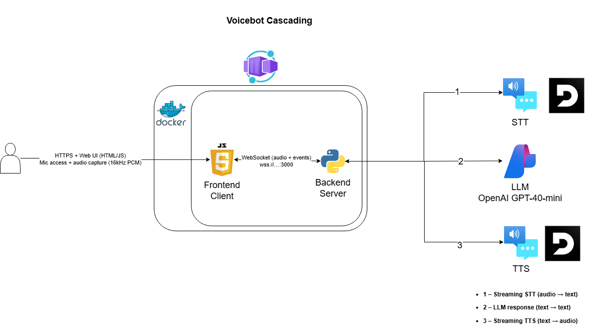

# 🎙️ General AI Voice Assistant Template

<div align="center">

**A Real-Time, General-Purpose AI Voice Agent**
*Powered by Azure OpenAI & Azure Speech*

[](https://www.python.org/)
[](Dockerfile)
[](https://azure.microsoft.com/)

</div>

---

## 📖 Overview

This is a **low-latency voice assistant template** designed as a clean starting point for building custom voice agents. It combines real-time streaming speech processing (STT/TTS) with Azure OpenAI for intelligent responses.

It features a modern, responsive UI with **AR (Black)** and **Light (White)** modes, and dynamic context switching between Voice and Chat interactions.

### 🚜 Looking for the Farmer Implementation?
This template was derived from a specialized USDA Farmer Grant Assistant. If you are looking for an example of how to integrate **MCP Tools** (Function Calling) for real-world use cases (like PDF form filling, API data fetching, etc.), please refer to the original implementation:

👉 **[Voicebot Farmer Grants Repository](https://github.com/Banudeep/Voicebot-Farmer-Grants)**

---

## �️ Architecture



---

## �🌟 Key Features

### ⚡ Real-Time Interaction
- **Low Latency:** Optimized streaming pipeline for near-instant voice responses.
- **Interruption Handling:** Capable of handling interruptions naturally.

### 🎨 Modern UI
- **Dual Visual Modes:**
    - **AR Mode:** Pure black interface optimized for AR glasses or OLED screens.
    - **Light Mode:** Clean, high-contrast white interface.
- **Dynamic Icons:** Interface elements (Microphone/Chat Bubble) adapt based on the active input mode.

### 🧠 General Purpose
- **Clean Slate:** No domain-specific tools pre-installed.
- **Cascading Architecture:** Modular design separating STT, LLM, and TTS streams.
    > *Interesting in an end-to-end Speech-to-Speech approach using the **GPT Realtime API**? Check out the [Voicebot STS Repository](https://github.com/Banudeep/Voicebot-STS) for an alternative architecture.*
- **Extensible:** Ready for you to add your own tools and system prompts.

---

## 🚀 Quick Start

### 1. Requirements
- **Docker** (Recommended) or Python 3.11+
- **Azure OpenAI Service** (GPT-4o or similiar)
- **Azure Speech Service** (Key & Region)

### 2. Configuration
Copy the example environment file and fill in your keys:

```bash
cp .env.example .env
```
*See `.env.example` for details on API keys.*

### 3. Run with Docker
The easiest way to run the full stack:

```bash
docker compose up --build
```
Open your browser to **http://localhost:8080** and click "Connect".

---

## 🛠️ Project Structure

```
voice_agent/
├── web_voice_agent.py          # 🚀 Main WebSocket Server & Orchestrator
├── llm_stream.py               # 🧠 Azure OpenAI Manager
├── stt_stream.py               # 🎤 Speech-to-Text Stream Handler
├── tts_stream.py               # 🔊 Text-to-Speech Stream Handler
├── config.py                   # ⚙️ Configuration & Environment Loading
├── mcp_tools/                  # 🧩 Tool Directory (Empty Template)
├── prompts/
│   └── general.yml             # 🎭 General System Prompt
├── web_ui/                     # 🌐 Frontend Interface
│   ├── voice_agent.html
│   └── audio-processor.js
└── docker-compose.yml          # 🐳 Container Orchestration
```

## 🔒 Security & Privacy
- **No Data Retention:** Voice audio is processed in memory (unless recording is explicitly enabled).
- **Azure Security:** Relies on enterprise-grade Azure Cognitive Services.

---