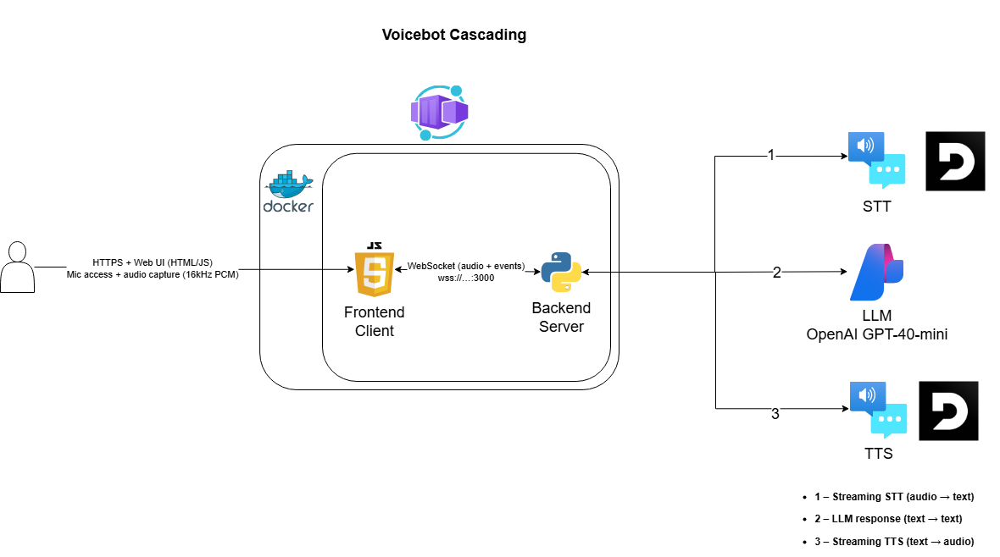

# 🎙️ Voice Agent

<div align="center">

**Web-Based Voice Assistant with Multi-Provider Support**

_Real-time voice conversations powered by OpenAI GPT-4 and Azure OpenAI_

[](https://www.python.org/)
[](LICENSE)
[](Dockerfile)

</div>

---

## 🌟 What This App Does

The **Voice Agent** is a real-time voice assistant that enables natural, conversational interactions through a modular architecture. It processes speech through separate STT, LLM, and TTS services, providing:

- ⚡ **Low latency** voice interactions
- 🎯 **Multi-provider support** (Deepgram, Azure Speech, OpenAI, Azure OpenAI)
- 🔊 **High-quality audio** at 16kHz
- 🌐 **Cloud-ready** with Docker and Azure Container Apps support
- 🔧 **Fully configurable** providers and behavior

---

## ✨ Key Features

### 🎤 **Speech-to-Text (STT)**

- **Deepgram** - Fast, accurate transcription
- **Azure Speech Services** - Enterprise-grade STT
- **Real-time streaming** with interim results
- **16kHz PCM16 audio** processing

### 🧠 **AI Processing**

- **OpenAI GPT-4** - Standard OpenAI API
- **Azure OpenAI** - Enterprise deployment support
- **Streaming responses** for immediate feedback
- **Conversation history** management
- **MCP tool integration** support

### 🔊 **Text-to-Speech (TTS)**

- **Deepgram** - Natural voice synthesis
- **Azure Speech Services** - 400+ voice options
- **Multiple language support**
- **Low-latency audio generation**

### 🎨 **Modern Web Interface**

- **Beautiful, responsive UI** with real-time status indicators
- **Live transcription** of user speech
- **Chat history** with user and AI messages
- **Audio playback** with interruption support

### ☁️ **Production-Ready Deployment**

- **Docker support** with optimized image
- **Azure Container Apps** compatible
- **Unified WebSocket** on single port
- **Environment-based configuration**

### 🔧 **Advanced Configuration**

- **Provider selection** (Deepgram or Azure for STT/TTS)
- **Customizable system prompts**
- **Adjustable speech timeouts**
- **Optional audio recording** for debugging

---

## 🏗️ Architecture


````
                    DATA FLOW:

    1. User speaks → Browser captures audio (AudioWorklet)
    2. Audio sent via WebSocket → Voice Agent Server
    3. Server sends audio → STT Service
    4. STT returns transcript → Server
    5. Server sends transcript → LLM Service
    6. LLM returns text response → Server
    7. Server sends text → TTS Service
    8. TTS returns audio → Server
    9. Server sends audio via WebSocket → Browser
    10. Browser plays audio to user

````

### **Technology Stack**

- **Backend**: Python 3.11+ with asyncio
- **Web Server**: aiohttp (unified HTTP + WebSocket on port 8080)
- **Audio Processing**: AudioWorklet API (browser-side)
- **STT Providers**: Deepgram, Azure Speech Services
- **LLM Providers**: OpenAI GPT-4, Azure OpenAI
- **TTS Providers**: Deepgram, Azure Speech Services
- **Deployment**: Docker + Azure Container Apps

---

## 🚀 Quick Start

### Prerequisites

- Python 3.11 or higher
- API keys for:
  - **STT/TTS**: Deepgram OR Azure Speech Services
  - **LLM**: OpenAI OR Azure OpenAI
- Modern web browser with WebRTC support

### Local Installation

1. **Navigate to the project:**

   ```bash
   cd voice_agent
````

2. **Create virtual environment:**

   ```bash
   python -m venv venv
   source venv/bin/activate  # On Windows: venv\Scripts\activate
   ```

3. **Install dependencies:**

   ```bash
   pip install -r requirements.txt
   ```

4. **Configure environment:**

   Create a `.env` file:

   ```env
   # Required: STT/TTS Provider (choose one or both)
   DEEPGRAM_API_KEY=your-deepgram-key-here

   # OR Azure Speech Services
   USE_AZURE_SPEECH=true
   AZURE_SPEECH_KEY=your-azure-speech-key
   AZURE_SPEECH_REGION=eastus
   AZURE_SPEECH_LANGUAGE=en-US
   AZURE_SPEECH_VOICE=en-US-JennyNeural

   # Provider Selection
   STT_PROVIDER=deepgram  # or "azure"
   TTS_PROVIDER=deepgram  # or "azure"

   # Required: LLM Provider (choose one)
   OPENAI_API_KEY=your-openai-api-key-here
   OPENAI_MODEL=gpt-4o

   # OR Azure OpenAI
   USE_AZURE=true
   AZURE_OPENAI_ENDPOINT=https://your-resource.cognitiveservices.azure.com
   AZURE_OPENAI_API_KEY=your-azure-openai-key
   AZURE_OPENAI_DEPLOYMENT=gpt-4o-mini
   AZURE_API_VERSION=2025-01-01-preview

   # Optional settings
   ENABLE_RECORDINGS=false  # Set to true to save audio recordings
   DEBUG=true
   VERBOSE=false
   ```

5. **Run the server:**

   ```bash
   python web_voice_agent.py
   ```

6. **Open in browser:**

   ```
   http://localhost:8080
   ```

---

## 🐳 Docker Deployment

### Build and Run Locally

```bash
# Build the image
docker build -t voice-agent .

# Run with environment variables
docker run -p 8080:8080 \
  -e DEEPGRAM_API_KEY=your-key \
  -e OPENAI_API_KEY=your-key \
  voice-agent

# Run with Azure OpenAI
docker run -p 8080:8080 \
  -e USE_AZURE=true \
  -e AZURE_OPENAI_ENDPOINT=https://your-resource.cognitiveservices.azure.com \
  -e AZURE_OPENAI_API_KEY=your-key \
  -e AZURE_OPENAI_DEPLOYMENT=your-deployment \
  -e DEEPGRAM_API_KEY=your-key \
  voice-agent
```

### Docker Compose

```bash
# Create .env file with your credentials, then:
docker-compose up --build
```

### Push to Docker Hub

```bash
docker build -t YOUR_USERNAME/voice-agent:latest .
docker push YOUR_USERNAME/voice-agent:latest
```

---

## ⚙️ Configuration

### Environment Variables

| Variable                  | Description                       | Required                           |
| ------------------------- | --------------------------------- | ---------------------------------- |
| `STT_PROVIDER`            | STT provider (`deepgram`/`azure`) | No (default: `deepgram`)           |
| `TTS_PROVIDER`            | TTS provider (`deepgram`/`azure`) | No (default: `deepgram`)           |
| `DEEPGRAM_API_KEY`        | Deepgram API key                  | Yes (if using Deepgram)            |
| `USE_AZURE_SPEECH`        | Use Azure Speech Services         | No (default: `false`)              |
| `AZURE_SPEECH_KEY`        | Azure Speech API key              | Yes (if `USE_AZURE_SPEECH=true`)   |
| `AZURE_SPEECH_REGION`     | Azure Speech region               | Yes (if `USE_AZURE_SPEECH=true`)   |
| `AZURE_SPEECH_LANGUAGE`   | Speech language                   | No (default: `en-US`)              |
| `AZURE_SPEECH_VOICE`      | TTS voice name                    | No (default: `en-US-JennyNeural`)  |
| `USE_AZURE`               | Set to `true` for Azure OpenAI    | No (default: `false`)              |
| `OPENAI_API_KEY`          | OpenAI API key                    | Yes (if `USE_AZURE=false`)         |
| `OPENAI_MODEL`            | OpenAI model name                 | No (default: `gpt-4o`)             |
| `AZURE_OPENAI_ENDPOINT`   | Azure OpenAI endpoint URL         | Yes (if `USE_AZURE=true`)          |
| `AZURE_OPENAI_API_KEY`    | Azure OpenAI API key              | Yes (if `USE_AZURE=true`)          |
| `AZURE_OPENAI_DEPLOYMENT` | Azure deployment name             | Yes (if `USE_AZURE=true`)          |
| `AZURE_API_VERSION`       | Azure API version                 | No (default: `2025-01-01-preview`) |
| `ENABLE_RECORDINGS`       | Save audio recordings             | No (default: `false`)              |
| `DEBUG`                   | Enable debug logging              | No (default: `false`)              |
| `VERBOSE`                 | Enable verbose logging            | No (default: `false`)              |

### Config File (`config.py`)

Customize behavior by editing `config.py`:

```python
# System prompt
SYSTEM_PROMPT = """You are a helpful voice assistant..."""

# Speech detection
END_OF_SPEECH_TIMEOUT = 0.8  # Seconds to wait after speech ends

# LLM settings
OPENAI_TEMPERATURE = 0.7  # Response creativity (0.0-1.0)
OPENAI_MAX_TOKENS = 1000  # Maximum response length

# Conversation history
MAX_CONVERSATION_HISTORY = 20  # Number of messages to remember
```

---

## 🎯 Features in Detail

### 1. **Real-Time Audio Processing**

- **16kHz sample rate** for optimal quality
- **20ms frame size** (320 samples) for low latency
- **PCM16 format** (16-bit signed integer)
- **Mono channel** for efficient processing

### 2. **Multi-Provider Support**

- **Flexible STT/TTS** - Choose Deepgram or Azure per service
- **LLM flexibility** - Switch between OpenAI and Azure OpenAI
- **Easy configuration** via environment variables
- **Provider-specific optimizations**

### 3. **Natural Conversation Flow**

- **Streaming responses** for immediate feedback
- **Interruption support** - users can interrupt AI mid-response
- **Live transcription** of user speech
- **Context preservation** - maintains conversation history

### 4. **Live Transcription**

- **Real-time user speech** transcription
- **AI response** text displayed in chat
- **Streaming updates** as AI generates response
- **Partial transcripts** for faster feedback

### 5. **Web Interface Features**

- **Connection status** indicators
- **Live transcription** display
- **Chat history** with user and AI messages
- **Audio playback** with visual feedback
- **Responsive design** works on desktop and mobile

### 6. **Production Features**

- **Error handling** with detailed logging
- **Connection management** (auto-reconnect)
- **Audio recording** (optional, for debugging)
- **Health checks** for container orchestration
- **Unified port** (8080) for HTTP and WebSocket

## 🔧 Advanced Usage

### Audio Recording

Enable recordings for debugging:

```env
ENABLE_RECORDINGS=true
```

Recordings are saved to `recordings/` directory as WAV files with timestamps.

### Custom System Prompt

Personalize the AI's behavior:

```python
SYSTEM_PROMPT = """You are a friendly customer service assistant.
Always be polite and helpful. Keep responses under 2 sentences."""
```

### Adjust Speech Timeout

Control how quickly the agent responds:

```python
END_OF_SPEECH_TIMEOUT = 0.8  # Seconds (lower = faster response)
```

---

## 🌐 Azure Container Apps Deployment

### Prerequisites

- Azure Container Apps environment
- Docker Hub account (or Azure Container Registry)
- Azure OpenAI resource (if using Azure)

### Deployment Steps

1. **Build and push to Docker Hub:**

   ```bash
   docker build -t YOUR_USERNAME/voice-agent:latest .
   docker push YOUR_USERNAME/voice-agent:latest
   ```

2. **In Azure Container Apps:**

   - Create new revision
   - Set image: `YOUR_USERNAME/voice-agent:latest`
   - Configure environment variables
   - Set **Target port: 8080** in Ingress settings
   - Deploy

3. **The app will be accessible at:**

   ```
   https://your-app.azurecontainerapps.io
   ```

### Environment Variables in Azure

Set these in Container Apps → Environment Variables:

```
STT_PROVIDER=azure
TTS_PROVIDER=azure
DEEPGRAM_API_KEY=your-key
USE_AZURE=true
AZURE_OPENAI_ENDPOINT=https://your-resource.cognitiveservices.azure.com
AZURE_OPENAI_API_KEY=your-key
AZURE_OPENAI_DEPLOYMENT=your-deployment
PORT=8080
HOST=0.0.0.0
```

---

## 🐛 Troubleshooting

### Connection Issues

**"Failed to connect to WebSocket"**

- ✅ Verify ports 8080 and 3000 are accessible
- ✅ Check firewall settings
- ✅ Ensure server is running
- ✅ Check browser console for errors

**"Azure OpenAI 404 errors"**

- ✅ Verify deployment name matches exactly (case-sensitive)
- ✅ Check API version is valid (try `2025-01-01-preview`)
- ✅ Ensure deployment is for "Chat Completions" (not Realtime API)
- ✅ Verify endpoint URL format

### Audio Issues

**No audio playback**

- ✅ Check browser console for errors
- ✅ Verify microphone permissions
- ✅ Try refreshing the page
- ✅ Check browser audio settings

**Audio not being captured**

- ✅ Grant microphone permissions
- ✅ Check browser console for errors
- ✅ Verify AudioWorklet is loading (`audio-processor.js`)
- ✅ Try a different browser

### Performance Issues

**STT taking too long**

- ✅ Azure STT: Interim results are enabled for faster response
- ✅ Reduce `END_OF_SPEECH_TIMEOUT` in `config.py`
- ✅ Check network latency to STT service
- ✅ Consider using Deepgram for faster STT

**High latency**

- ✅ Check network connection speed
- ✅ Verify you're using a supported region
- ✅ Reduce other network traffic
- ✅ Check Azure OpenAI resource location

---

## 📁 Project Structure

```
voice_agent/
├── web_voice_agent.py    # Main server and orchestrator
├── stt_stream.py         # Speech-to-Text module
├── llm_stream.py         # LLM processing module
├── tts_stream.py         # Text-to-Speech module
├── config.py             # Configuration settings
├── requirements.txt      # Python dependencies
├── Dockerfile            # Docker build instructions
├── docker-compose.yml    # Docker Compose configuration
├── .dockerignore         # Docker ignore patterns
├── README.md             # This file
├── recordings/           # Audio recordings (if enabled)
└── web_ui/
    ├── voice_agent.html  # Web interface
    └── audio-processor.js # AudioWorklet processor
```

---

## 🔐 Security Notes

- **API Keys**: Never commit `.env` files or expose API keys
- **HTTPS**: Use HTTPS in production (Azure Container Apps provides this)
- **CORS**: Currently configured for localhost (adjust for production)
- **WebSocket**: Uses WSS (secure WebSocket) when served over HTTPS

---

## 📝 License

MIT License - see LICENSE file for details

---

## 🙏 Acknowledgments

- **OpenAI** for GPT-4 API
- **Deepgram** for fast STT/TTS
- **Azure** for enterprise services and container hosting
- Built with ❤️ using Python, aiohttp, and modern web technologies

---

## 📧 Support

For issues, questions, or contributions, please open an issue on GitHub.

---

<div align="center">

**Made with ❤️ for natural voice interactions**

[⭐ Star this repo](https://github.com/yourusername/voice-agent) if you find it useful!

</div>
